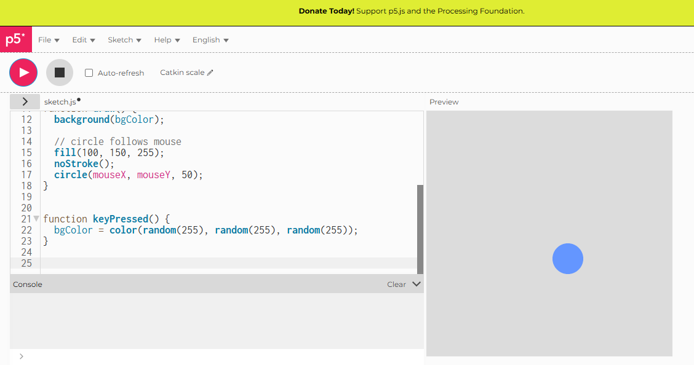

# Interaction with Mouse or Keyboard

## Live Sketch
[View the live version here](https://iahmonte09.github.io/Creative-Coding-Portfolio/interaction/)

## Screenshot

## Description and Reflection

The sketch responds to the user input by changing visual elements based on mouse movement and/or keyboard interaction. In this case, the position of the circle are controlled by the mouse allowing the user to directly influence the sketch in real time.
I decided to make the background change color by the press of a key on the keyboard this made the interaction more engaging and fun for the user
This exercise showed how interaction can be used as a creative tool rather than just a technical feature.

