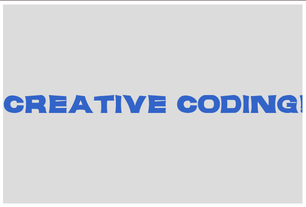

# Load Fonts and Draw Text

## Live Sketch
[View here](https://iahmonte09.github.io/Creative-Coding-Portfolio/load-fonts-and-draw-text/)

## Screenshot

## Description and Reflection

This experiment shows how to load a custom font and display text with p5.js. I used the jangkuy.I loaded the otf font file in the preload() function to make sure the font is ready before the sketch begins. I used textFont(), textSize(), and textAlign() to show the text “Creative Coding!” on the screen.The text is placed right in the middle of the canvas using the Jangkuy font.
The controlled parts are the text content, size, and position, while the creative side comes in when picking a unique font style to give the sketch its own look. Using a custom font gives your work some character and shows how you can mix typography into generative visuals.
One problem was making sure the font loaded properly before the text showed up. Using preload() fixed the problem and made sure the sketch always showed the right font. This exercise gave me a better handle on how to manage resources in p5.js, why file paths matter, and how typography can make interactive sketches look better. animations
