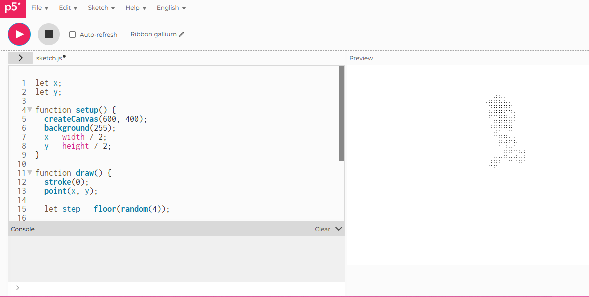

# Random walker

## Live Sketch
[View the live version here](https://iahmonte09.github.io/Creative-Coding-Portfolio/random-walker/)

## Screenshot

## Description and reflection

This experiment looks into randomness by using a classic random walker algorithm. The walker starts right in the middle of the canvas and moves randomly in one direction each frame either up, down, left, or right. As time goes on, this leads to a path across the canvas thats hard to predict.
The controlled elements are the step size and canvas dimensions, which help keep the movement and spacing steady. the unpredictable part comes from picking the direction every frame with the random() function. Each time the sketch runs, it makes a different visual pattern that's one of a kind.
One challenge was keeping the movement clear and steady. Changing the step size made it easier to find a good mix between clear and random. This exercise really helped me see how randomness can create natural and unexpected patterns inside organized systems.
