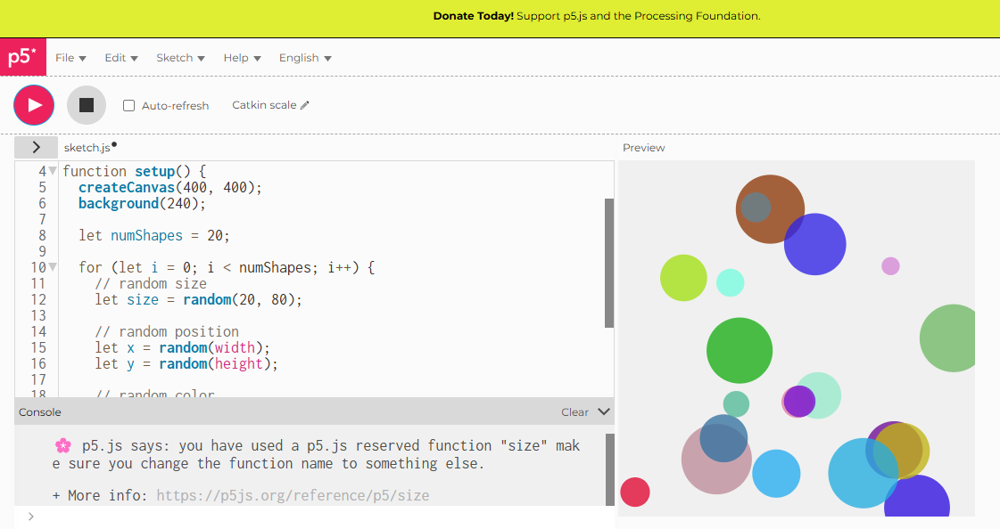

# Randomness Experiment

## Live Sketch
[View the live version here](https://iahmonte09/Creative-Coding-Portfolio/randomness/)

## Screenshot

## Description and Reflection

Reflection on Control vs Unpredictability:  
When it comes to the sketch, we see that the size of the canvas, the total number of shapes, and the overall drawing structure are well-controlled aspects. Coming from a different angle, the colors, positions and sizes of the shapes that are randomly generated every time the sketch is refreshed can be seen as unpredictable. But, it's the harmony between the two, control and randomness that really gives the sketch its unique appearance and visual balance.

One challenge was preventing shapes from appearing off the screen or overlapping too much. To resolve this, I limited the range of random values so that all shapes stayed within the canvas boundaries. This reinforced the idea that randomness in creative coding must still be carefully constrained to achieve intentional visual results.

This experiment demonstrated how controlled systems combined with unpredictable elements can produce engaging and different generative visuals.

