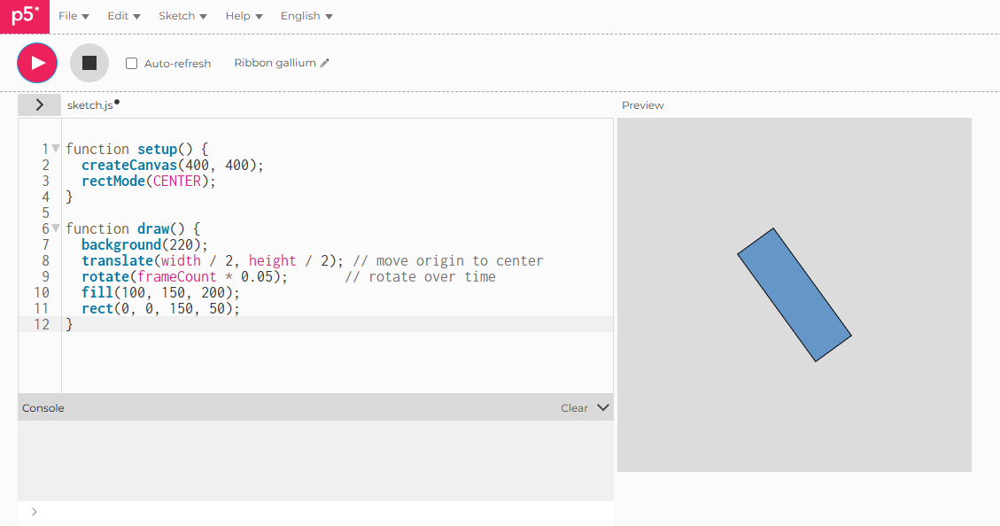

# Rotate the Coordinate System

## Live Sketch
[View here](https://iahmonte09.github.io/Creative-Coding-Portfolio/rotate-coordinate-system/)

## Screenshot

## Description and Reflection

This experiment looks at how the coordinate system rotates in p5.js. I moved the origin to the center of the canvas and then used the rotate() function to make the rectangle spin smoothly over time. This shows how coordinate transformations can make visuals more dynamic and interesting.
The size of the rectangle and the rotation speed are the controlled elements that keep things running consistently. The unpredictable part comes from how the rotation mixes with where the shapes are placed to create the visual effect. Doing this experiment showed me how using transformations like translate() and rotate() changes everything I draw afterward.
One tricky part was figuring out how rotation happens around the origin. Moving the origin to the center of the canvas made it much easier to control and predict how things would rotate. This exercise really helped me get a better grasp on coordinate systems and how transformation functions work in creative coding.
