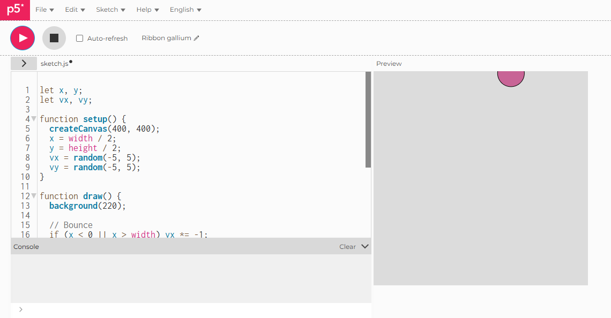

# Shake Bounce Ball

## Live Sketch
[View here](https://iahmonte09.github.io/Creative-Coding-Portfolio/shake-bounce-ball/)

## Screenshot

## Description and Reflection

This experiment mixes movement, randomness, and collision detection. A ball rolls around the canvas, bouncing when it hits the edges and adding little random shakes as it moves. This makes the movement lively and a bit unexpected.
The parts that were controlled are the canvas size, ball size, and base velocity. The unpredictable part comes from the ball’s position being randomly shaken each frame, which makes the movement less regular.
One challenge was keeping the ball in sight while still adding some randomness. I kept the shake values limited and bounced the velocity back at the edges to make sure the ball kept moving without ever going off the canvas. Doing this exercise showed me how mixing set movements with some random changes can make animations look more natural and way more interesting to watch.
Click to change sentence
