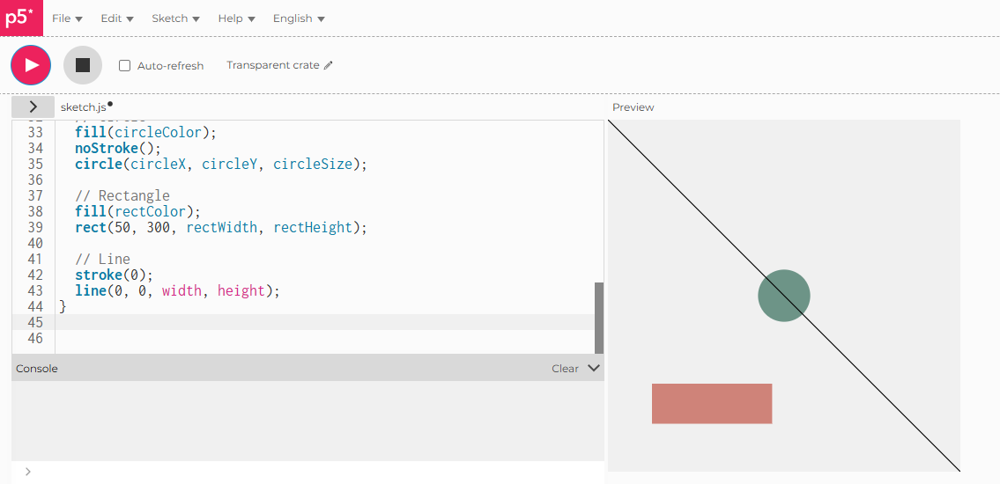

# Shapes with Variables

## Live Code
(https://iahmonte09.github.io/Creative-Coding-Portfolio/shapes-with-variables/)

## Screenshot

## Description and Reflection

When working with p5.js I found that variables can control the properties of different shapes, like circles, rectangles and lines. Coming from the exercises in class, where we investigated how variables affect what we see on the screen, I created three basic shapes that demonstrate this. The size and position of the circle, the dimensions of the rectangle and the colors of both shapes are randomly determined every time the sketch runs, and therefore add a bit of unpredictability to it. 

The inspiration behind this sketch was the initial exercises, and mesing with the range of values that i'm using to set the size and color of the shapes really helped me get a grip on how they affect the look of the scene. Standard RGB wasn't quite giving me enough contrast, so I decided to use full ranges to ensure that the colors would really pop out. 

One thing I found tricky was making sure that the shapes stay visible on the screen when their sizes are changing randomly, I overcame this by being more precise with the ranges I chose, and now everything works good. This exercise showed me the cause and effect relationship between the variables I set and the outcome of those settings, and that changing a few things can lead to a lot of different looks. Something that I think is quite empowering in generative visualisation.
