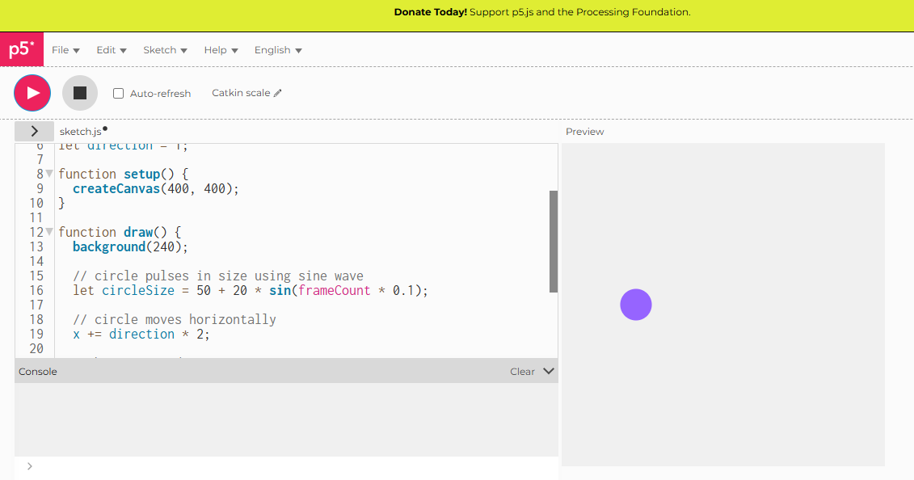

# Time-Based Animation

## Live Sketch
[View the live version here](https://iahmonte09/Creative-Coding-Portfolio/time-based-animation/)

## Screenshot

## Description and Reflection

time-based animation in p5.js, using frameCount to create movement and change over time. The program animates shapes by continuously updating their position, size, or color on each frame. then i experimented with different ways time could affect the visual outcome such as moving shapes across the canvas and creating pulsing effects. I was able to create smooth and continuous motion.
At first though the movement was too fast and visually overwhelming. I resolved this by adjusting the values, which allowed the animation to slow down. This helped me understand how a big difference a small numerical change can have.
